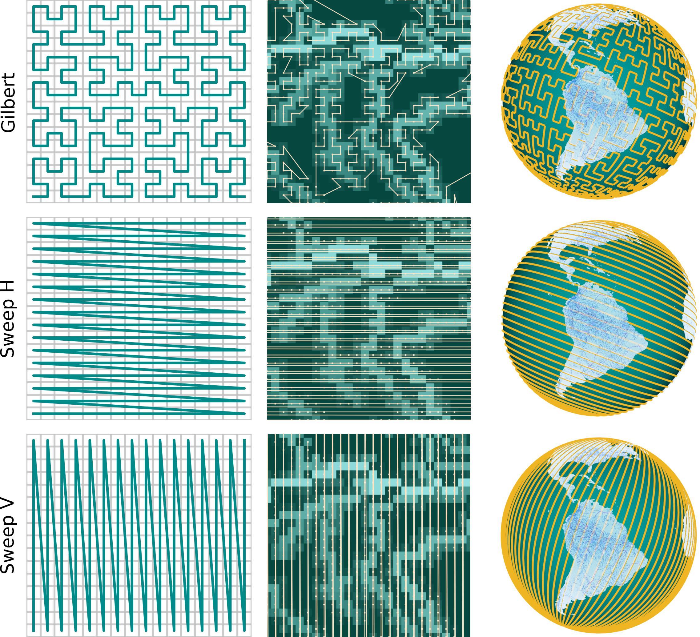

[](https://hakamshams.github.io/RiverMamba/)
[](https://doi.org/10.48550/arXiv.2505.22535)


 

# RiverMamba

RiverMamba: A State Space Model for Global River Discharge and Flood Forecasting

Computer Vision Group, Institute of Computer Science III, University of Bonn.

This is the code to reproduce the results presented in the paper:
["**RiverMamba: A State Space Model for Global River Discharge and Flood Forecasting**"](https://arxiv.org/abs/2505.22535) by [Mohamad Hakam Shams Eddin](https://hakamshams.github.io/), [Yikui Zhang](https://github.com/yikuizh), [Stefan Kollet](https://www.fz-juelich.de/profile/kollet_s), and [Juergen Gall](http://pages.iai.uni-bonn.de/gall_juergen/). 
Accepted at [NeurIPS'25 Main Conference Track](https://neurips.cc/virtual/2025/poster/118456).

### [Website of RiverMamba](https://hakamshams.github.io/RiverMamba/) | [Paper](https://arxiv.org/abs/2505.22535)

<table><tr><td>
  
</td></tr></table>

RiverMamba is a novel deep learning model that is pretrained with long-term reanalysis data and fine-tuned on observations to forecast global river discharge and floods up to 7 days lead time on a 0.05° grid.

## Setup

### Environment
For pip with a virtual environment:
```
virtualenv <env_name>
source <env_name>/bin/activate
pip install -r requirements.txt
```
For conda:
```
conda create --name <env> --file requirements.txt
```

Pytorch has to be updated to be computable with your GPU driver.

For incompatibility issues, you can install Mamba:
```
pip install mamba-ssm[causal-conv1d]
```
Try --no-build-isolation when using pip if the installation encounters issues.

And if you encountered issues while installing flash-attention. Make sure that ninja is installed and that it works correctly (e.g. ninja --version then echo $? should return exit code 0). If not (sometimes ninja --version then echo $? returns a nonzero exit code), uninstall then reinstall ninja (pip uninstall -y ninja && pip install ninja). Without ninja, compiling can take a very long time (2h) since it does not use multiple CPU cores. With ninja compiling takes 3-5 minutes on a 64-core machine using CUDA toolkit. Then Transformer with Flash-Attention can be installed with:

```
pip install flash-attn --no-build-isolation
```

### Vision Mamba

Inside the models there is a [vim folder](models/vim). This is based on Vision Mamba works i.e., https://github.com/hustvl/Vim/tree/main/vim.
You have to copy the scripts inside this folder into their respective directory after you set up the environment.
For example if you set up a virtual environment then [mamba_simple.py](models/vim/mamba_simple.py) and [mamba2_simple.py](models/vim/mamba2_simple.py) should be copied to the directory:

./<env_name>/lib/<python_version>/site-packages/mamba_ssm/modules/

and the script [selective_scan_interface.py](models/vim/selective_scan_interface.py) should be copied to the directory:

./<env_name>/lib/<python_version>/site-packages/mamba_ssm/ops/

For conda the main directory would be in a directory similar to:

/home/<user_name>/.conda/envs/<env_name>/lib/<python_version>/site-packages/mamba_ssm

## Code

The code has been tested under Pytorch (1.12.1 & 2.5.1) and Python 3.10.0 on Ubuntu 20.04.5 LTS with NVIDIA A100 GPUs and GeForce RTX 3090 GPU.

### Configuration

The main config file [config.py](config.py) includes the parameters for training and testing and models.

### Training

To train RiverMamba:
```
  python train.py
```
For Multi-GPUs training:
```
  python train_multinode.py
```

The code in [train.py](train.py) is implemented with a simple DataParallel for multi-GPUs. 
The script [train_multinode.py](train_multinode.py) is implemented with PyTorch DDP for multi-nodes and multi-GPUs training.

Training on real-world different than the one in the paper, requires fine-tuning for the hyper-parameters and weighting.

### Inference

To run inference on the AIFAS sampled diagnostic river points:
```
  python inference_aifas.py
```
To run inference on the full resolution map:
```
  python inference_full_map.py
```

The AIFAS points include 1,529,667 sampled points along rivers globally. 
While the full resolution map (3000 x 7200) includes 6,221,926 points on land at 0.05°.
The inference scripts will divide the data along the first curve and run inference sequentially. 
For example, for the AIFAS points (1,529,667) with a trained model on n_points=254945, the inference will divide the data along the curve into 6 samples where each sample will be equal to n_points (except maybe the last sample).
The inference will then combine the forecasts along these samples to generate the final file.
The script inference_aifas.py will index the final file to output only where GRDC stations are available, but you can change this easily.

### Space-filling Curves



The name of the config file represents the name of the experiment.
Every config file is a combination of different variables, events and coupling setting between the anomalies and extreme events.
The folder [serialization](serialization) contains the scripts to generate different types of space-filling curves serialization.
Use the main script [generate_curves](serialization/generate_curves.py) to generate the serialization. The output is the position of the 2D point/pixel within the 1D sequence. 
The following curves are supported:
- [Gilbert](serialization/gilbert.py): Generalized Hilbert curve is a Hilbert space-filling curve for a rectangular domains of arbitrary non-power of two sizes. 
We used the numpy implementation of (https://github.com/jakubcerveny/gilbert) to generate the curves. 
- [Sweep_h](serialization/sweep_h.py): This curve fills in the space like a spherical helix or a Luxodrome around the sphere in the horizontal direction.
- [Sweep_v](serialization/sweep_v.py): This curve fills in the space like a spherical helix or a Luxodrome around the sphere in the vertical direction.
- [Zigzag_h](serialization/sweep_h.py): This curve is similar to the Sweep_h curve. The main difference is that the transformation ensures that every neighboring points on the curve are also neighboring in the physical space.
- [Zigzag_v](serialization/sweep_h.py): This curve is similar to the Sweep_v curve. The main difference is that the transformation ensures that every neighboring points on the curve are also neighboring in the physical space.

### Backbones
- [x] [Transformer with Flash-Attention](models/encoder/FlashTransformer.py)
- [x] [Vision Mamba](models/encoder/Mamba.py)
- [x] [Vision Mamba2](models/encoder/Mamba2.py)

### Baselines
- [x] [Encoder-Decoder LSTM (ed-lstm model based on Google operational model)](lstm_repo)

### Pretrained models

#### AIFAS points

| name                        | domain  | # point   | target data       | training  | config                                                                                                                                                                                                                    | model                                                                                                                                                                                                                         |
|:----------------------------|:--------|:----------|:------------------|:----------|:--------------------------------------------------------------------------------------------------------------------------------------------------------------------------------------------------------------------------|:------------------------------------------------------------------------------------------------------------------------------------------------------------------------------------------------------------------------------|
| RiverMamba_aifas_reanalysis | global  | 1,529,667 | GloFAS reanalysis | 1979-2018 | [config](https://drive.usercontent.google.com/download?id=13qydeWgRuwWfl4yNL478OCW2jmypKjH9&export=download&authuser=1&confirm=t&uuid=20141947-d7e6-4565-92f0-7db6c690e416&at=AN8xHoptLYctYn9ftqObhfUmb2oN:1758717542872) | [checkpoint](https://drive.usercontent.google.com/download?id=10zRL6XOepFHBtyia-8rskWIGWdKyS45u&export=download&authuser=1&confirm=t&uuid=26ccb38d-2694-410e-be5e-3af69bd51263&at=AN8xHorvCwCVc-MS_DrG7Z1nrowt:1758717541940) |
| RiverMamba_aifas_reanalysis | global  | 1,529,667 | GRDC observations | 1979-2018 | [config](https://drive.usercontent.google.com/download?id=1xsiPII8s41bgVOJIu2yhrQHk8pHrn1AY&export=download&authuser=1&confirm=t&uuid=7d402dae-b604-401b-856a-8b61b010afe7&at=AN8xHoqKJUGKp5OyEEpEYAhopLt5:1758717532206) | [checkpoint](https://drive.usercontent.google.com/download?id=10bCiFnCdOVP08jtZbIc-wxRsKYNW80oo&export=download&authuser=1&confirm=t&uuid=73c6d73e-6fd2-4c00-8e2e-2eff029a00d5&at=AN8xHoqTcHhq4gMlaa1ZWAXFsj_M:1758717530849) |

#### FUll resolution

| name                        | domain  | resolution           | # point   | target data       | training  | config                                                                                                                                                                                                                    | model                                                                                                                                                                                                                         |
|:----------------------------|:--------|:---------------------|:----------|:------------------|:----------|:--------------------------------------------------------------------------------------------------------------------------------------------------------------------------------------------------------------------------|:------------------------------------------------------------------------------------------------------------------------------------------------------------------------------------------------------------------------------|
| RiverMamba_aifas_reanalysis | global  | 3000 x 7200 at 0.05° | 6,221,926 | GloFAS reanalysis | 1979-2023 | [config](https://drive.usercontent.google.com/download?id=1ThAt9KK1c1SeBfFyOL6kQ5QAUg-xUmIQ&export=download&authuser=1&confirm=t&uuid=322b615e-4de1-4c69-a8b4-5929ce96e45f&at=AN8xHopPwAk2FUlRaSD_hczAsfZd:1758717555820) | [checkpoint](https://drive.usercontent.google.com/download?id=1SyRlk7pQIyWvwEQT3GBj0x1tV8PmJCTE&export=download&authuser=1&confirm=t&uuid=d6553d88-9973-48cb-855f-8cf06b324248&at=AN8xHopv0fWuYYdhiuqXcAcQls_c:1758717554697) |

### Reforecasts

#### AIFAS points

| name                         | model                | domain | # stations | target data       | training  | reforecasts  | download                                                                                                                                                                                                                                        |
|:-----------------------------|:---------------------|:-------|:-----------|:------------------|:----------|:-------------|:------------------------------------------------------------------------------------------------------------------------------------------------------------------------------------------------------------------------------------------------|
| LSTM_glofas_reanalysis       | Encoder-Decoder LSTM | global | 3366       | GloFAS reanalysis | 1979-2018 | 2019-2024    | [LSTM_glofas_reanalysis](https://drive.usercontent.google.com/download?id=1uWIE0DeQpwVvi7ElzZflRPJtGSmgJhy1&export=download&authuser=1&confirm=t&uuid=7b33e965-06e9-405d-bcba-24819ae3f591&at=AN8xHorgyhw34gYPGeER1Sylq2Y4:1758644507546)       |
| LSTM_grdc_obs                | Encoder-Decoder LSTM | global | 3366       | GRDC observations | 1979-2018 | 2019-2024    | [LSTM_grdc_obs](https://drive.usercontent.google.com/download?id=1o8pDmdLQzX0QMK_YgkNgSwlWPQdOrdsE&export=download&authuser=1&confirm=t&uuid=df16214a-52d9-447c-80ea-92157f5c4e82&at=AN8xHopiAwyzlBJlCYYezXjBGPi6:1758644532022)                                                                                                                                                                                                                               
| RiverMamba_glofas_reanalysis | RiverMamba           | global | 3366       | GloFAS reanalysis | 1979-2018 | 2019-2024    | [RiverMamba_glofas_reanalysis](https://drive.usercontent.google.com/download?id=1N17hkzzXrUhnul5Hq2GX9pyl3eewvfWN&export=download&authuser=1&confirm=t&uuid=dd018ce2-501e-44e5-b425-1da5a77a1f25&at=AN8xHorW_49pMi9HOYw8zCvPlnwC:1758644441757) |
| RiverMamba_grdc_obs          | RiverMamba           | global | 3366       | GRDC observations | 1979-2018 | 2019-2024    | [RiverMamba_grdc_obs](https://drive.usercontent.google.com/download?id=1nl1jRoIigCUvNComIpD7ePuwB8thABgT&export=download&authuser=1&confirm=t&uuid=882dbb4f-0ff0-4522-b904-c1f50b1125a6&at=AN8xHopr439FCITM9neb_exg78ey:1758644466322)          | 

Each netcdf reforecasts file has 7 time steps representing the 7 days lead time. The name of the file represent the day at which the forecast was issued at 00:00 UTC.
Each file has 3366 stations along the x-axis. Information about these stations can be obtained at [GRDC_Meta](https://drive.usercontent.google.com/download?id=1d0A9hCG5Rgo_5gTYxzEAC7avjguZ-R8h&export=download&authuser=1&confirm=t&uuid=7fd82e64-2dc7-4f1e-bf6f-fcb3dbbd800b&at=AN8xHoqGnIYoCUbobunEegdGJCfo:1758705147236).
The index AIFAS represents the index along the x-axis.

#### FUll resolution

| name                                  | model      | domain | resolution           | # points   | target data       | trained   | reforecasts | download            |
|:--------------------------------------|:-----------|:-------|:---------------------|:-----------|:------------------|:----------|:------------|:--------------------|
| RiverMamba_glofas_reanalysis_full_map | RiverMamba | global | 3000 x 7200 at 0.05° | 6,221,926  | GloFAS reanalysis | 1979-2023 | 2024        | (in preparation...) |

Each netcdf file in the RiverMamba_glofas_reanalysis_full_map reforecasts has 7 time steps representing the 7 days lead time. The name of the file represent the day at which the forecast was issued at 00:00 UTC.
Each file has also 6221926 points along the x dimension. This represents points on land at 0.05° resolution.
You can visualize the full map reforecast using the script [visualize_Reforecast](vis/visualize_Reforecast.py).

All models are deterministic and produced without nowcasting.

### Structure
```
.
├── config.py
├── dataset
│   └── RiverMamba_dataset.py
├── docs
│   ├── images
│   │   ├── curves.jpg
│   │   ├── mamba_logo.png
│   │   ├── NeurIPS-logo.svg
│   │   └── neurips-navbar-logo.svg
│   └── poster
│       └── RiverMamba_NeurIPS_25.jpg
├── inference_aifas.py
├── inference_full_map.py
├── LICENSE
├── log
├── lstm_repo
│   ├── ....
│   │   ├── ...
│   │   │   ├── ...
├── models
│   ├── build.py
│   ├── decoder
│   │   ├── FlashTransformer.py
│   │   ├── Mamba2.py
│   │   ├── Mamba.py
│   ├── encoder
│   │   ├── FlashTransformer.py
│   │   ├── Mamba2.py
│   │   ├── Mamba.py
│   ├── head
│   │   ├── MLP.py
│   ├── loan.py
│   ├── loss.py
│   ├── mha.py
│   └── vim
│       ├── mamba2_simple.py
│       ├── mamba_simple.py
│       └── selective_scan_interface.py
├── README.md
├── requirements.txt
├── run_multinode_jsc.sh
├── run_multinode_marvin.sh
├── serialization
│   ├── curves
│   ├── generate_curves.py
│   ├── gilbert.py
│   ├── sweep_h.py
│   ├── sweep_v.py
│   ├── zigzag_h.py
│   └── zigzag_v.py
├── train_multinode.py
├── train.py
├── utils
│   └── utils.py
└── vis
    ├── visualize_CPC_data.py
    ├── visualize_ERA5_Land_reanalysis_data.py
    ├── visualize_GloFAS_reanalysis_data.py
    ├── visualize_GRDC_obs_data.py
    ├── visualize_HRES_data.py
    ├── visualize_Reforecast.py
    └── visualize_Static_data.py
```

## Dataset

[in preparation...]

<!---
- The full data set can be obtained from [https://doi.org/10.60507/FK2/T8QYWE](https://doi.org/10.60507/FK2/T8QYWE) (~ 10 TB after decompression).
  - CPC data: 16 GB 
  - ERA5-Land reanalysis data: ~7.6 TB
  - ECMWF-HRES data: ~1.9 TB
  - GloFAS static data: ~46 GB
  - GloFAS-reanalysis data: ~600 GB

- The data is compressed. ERA5-Land and ECMWF-HRES data are organized so that each year inside the directory has its own compressed files.

- The data can be also downloaded via scripts found in [scripts](scripts) i.e., you can download the CPC data via [script/download_cpc.sh](scripts/download_cpc.sh) (~46 GB):
  ```
   wget --continue  https://bonndata.uni-bonn.de/api/access/datafile/xxxx -O CPC_Global.7z
  ```
  To extract the files you need the 7-Zip package:
  ```
   sudo apt update
   sudo apt install p7zip-full
  ```
  and for example to extract:
  ```
   7za x CPC_Global.7z
  ```

  ERA5-Land and ECMWF-HRES files are large, so they are split into smaller files. For example, after download to extract ERA5-Land data for the year 1979 just run:
  ```
   7za x 1979.7z.001
  ```
  7z will find 1979.7z.002 1979.7z.003 1979.7z.004 automatically.

- You can visualize the data using the scripts in [vis](vis).

- All data are at 00:00 UTC time. The data are provided at daily basis and the timestamp is right-labeled: i.e. river discharge on 01/01/2024 correspond to the mean river discharge for the day of 12/31/2023.

-->

### Citation
If you find our work useful, please cite:

```
@article{rivermamba,
         title={RiverMamba: A State Space Model for Global River Discharge and Flood Forecasting},
         author={Shams Eddin, Mohamad Hakam and Zhang, Yikui and Kollet, Stefan and Gall, Juergen},
         journal={arXiv preprint arXiv:2505.22535},
         year={2025}
         }		  
```

### Acknowledgments

This work was funded by the Federal Ministry of Education and Research (BMBF) under grant no. 01IS24075C [RAINA](https://raina-project.de/) and by the Deutsche Forschungsgemeinschaft (DFG, German Research Foundation) within the Collaborative Research Centre SFB 1502/1–2022 - [DETECT](https://sfb1502.de/) - [D05](https://sfb1502.de/projects/cluster-d/d05).

### License

The code is released under BSD 3-Clause License. See the [LICENSE](LICENSE) file for details.
Mamba is licensed with (Apache-2.0 license) and Flash-Attention (BSD 3-Clause License).